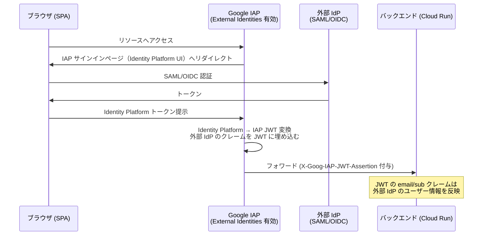

# SPA → BFF → IAP保護 Cloud Run 三層構成 技術検証レポート

> 調査日: 2026-06-01  
> 対象: Google Cloud Identity-Aware Proxy (IAP) + Cloud Run + OAuth BFF パターン  
> 調査方法: Google Cloud 公式ドキュメントの直接参照（2025〜2026年時点）

---

## 1. 結論

### 構成の成立可否

| パターン | 成立するか | 推奨度 |
|---|---|---|
| **パターンA**: BFF のサービスアカウント OIDC トークンで IAP を通過し、ユーザー identity は別途伝搬 | **成立する（推奨）** | |
| **パターンB**: 外部 IdP（Auth0/Okta 等）のアクセストークンをそのまま IAP に渡す | **成立しない** | x |
| **パターンB'**: IAP の External Identities 機能（Identity Platform 連携）でユーザー identity を保つ | **部分的に成立・制約あり** | 条件付き |
| **パターンC**: IAP を外し、Cloud Run の IAM Invoker で BFF SA を直接許可 | **成立する（シンプル）** | |

### 推奨パターン

**セキュリティ要件が高い場合**: パターンA（BFF SA + IAP + カスタムユーザー identity ヘッダー）

**シンプルさを優先する場合**: パターンC（IAP なし、Cloud Run IAM Invoker のみ）

前提となる重要事実：
- IAP はプログラムからのアクセスに対して **Google 発行の OIDC ID トークン**（audience = IAP の OAuth 2.0 クライアント ID）を要求する
- 外部 IdP（Auth0、Okta、Cognito）が発行したアクセストークン / ID トークンをそのまま IAP に渡しても **認証は通らない**
- この前提は **公式ドキュメントで明確に確認済み**

---

## 2. IAP for Cloud Run の認証仕様（論点1）

### 2-1. IAP が受け付けるトークンの仕様

IAP がプログラムからのアクセスを受け付ける場合、以下の2方式が公式にサポートされている。

#### 方式1: サービスアカウント OIDC トークン（推奨）

```
Authorization: Bearer <OIDC_ID_TOKEN>
```

- **audience**: IAP の OAuth 2.0 クライアント ID（`CLIENT_ID.apps.googleusercontent.com` 形式）
- **取得方法**: `google.oauth2.id_token.fetch_id_token(request, client_id)` または Metadata Server
- **発行者**: Google（`https://accounts.google.com`）

#### 方式2: サービスアカウント 自己署名 JWT

```
Authorization: Bearer <SELF_SIGNED_JWT>
```

- **aud**: IAP 保護リソースの完全 URL（例: `https://my-service-xxxx-uc.a.run.app/`）
- JWT クレーム: `iss`, `sub` にサービスアカウントのメールアドレスを設定

#### Proxy-Authorization ヘッダの利用

BFF が下流へ `Authorization` ヘッダをそのままプロキシする場合、代替として：

```
Proxy-Authorization: Bearer <OIDC_ID_TOKEN>
```

を使うことができる。IAP は `Proxy-Authorization` で認証し、元の `Authorization` ヘッダをバックエンドにそのまま転送する。

> **出典**: [Authenticating programmatic access to IAP-secured resources](https://docs.cloud.google.com/iap/docs/authentication-howto)

### 2-2. Cloud Run への IAP 適用方法（GA 状況）

IAP を Cloud Run に直接有効化する方法は2種類ある：

| 方式 | 特徴 | 備考 |
|---|---|---|
| **Cloud Run サービスに直接有効化** | `run.app` URL を含む全 ingress パスを保護 | 単一 Cloud Run サービス向けに推奨 |
| **Load Balancer のバックエンドとして有効化** | 複数リージョン対応可、`run.app` URL は別途対策必要 | 大規模構成向け |

**GA 状態について**: 公式ドキュメントは「IAP with Cloud Run Preview」からの移行として GA に言及している。Preview 期間中は `run.routes.invoke` 権限チェックが行われなかったが、**GA 時点からこの権限チェックが実施される**。

**重要制約**:
- ロードバランサーと Cloud Run サービスの両方で IAP を有効にすることはできない
- IAP は Cloud CDN と非互換
- IAP は `X-Serverless-Authorization` ヘッダを使って Cloud Run に認証する（このヘッダはサービス到達時に署名が除去される）

> **出典**: [Enabling Cloud IAP for Cloud Run](https://docs.cloud.google.com/iap/docs/enabling-cloud-run)  
> **出典**: [Configure IAP to secure access - Cloud Run IAM & Security](https://docs.cloud.google.com/run/docs/securing/managing-access)

### 2-3. 外部 IdP のトークンを IAP に渡せるか

**渡せない（直接は不可）**。

公式ドキュメントは明確に記載している：

> "Only Google Identities are supported for user account programmatic access in IAP. Identity Platform and Workforce Identity Federation identities are not supported for programmatic access."
>
> 出典: [Authenticating programmatic access to IAP](https://docs.cloud.google.com/iap/docs/authentication-howto)

Auth0 / Okta / Amazon Cognito 等の外部 IdP が発行した JWT を `Authorization: Bearer` に設定しても、IAP はこれを拒否する。

ただし、**ブラウザ経由のユーザー認証**については、IAP の External Identities 機能（Identity Platform 連携）を使うことで外部 IdP 経由のサインインを構成できる（後述）。

---

## 3. 各パターンの詳細とシーケンス図（論点2）

### パターンA: BFF サービスアカウントで IAP を通過する（推奨）

**概要**: BFF は自身のサービスアカウントで Google 署名の OIDC ID トークンを取得し、IAP に提示する。ユーザー identity は BFF が署名した独自ヘッダ（例: `X-User-Id`）または JWT で Cloud Run バックエンドに伝える。

```mermaid
sequenceDiagram
    participant Browser as ブラウザ (SPA)
    participant BFF as BFF (Cloud Run)<br/>OAuth Confidential Client
    participant IAP as Google IAP
    participant Backend as バックエンド (Cloud Run)
    participant ExtIdP as 外部 IdP<br/>(Auth0/Okta等)

    Note over Browser,BFF: 初回ログインフロー
    Browser->>BFF: GET /login
    BFF->>Browser: OAuth 認可 URI へリダイレクト
    Browser->>ExtIdP: 認可コード取得
    ExtIdP->>Browser: 認可コード
    Browser->>BFF: GET /callback?code=XXX
    BFF->>ExtIdP: トークンエンドポイント (code → tokens)
    ExtIdP->>BFF: access_token + refresh_token + id_token
    Note over BFF: トークンをサーバーサイドセッションに保存<br/>HttpOnly Cookie でセッション ID をブラウザへ発行

    Note over Browser,Backend: API コールフロー
    Browser->>BFF: POST /api/... (HttpOnly Cookie)
    BFF->>BFF: Cookie → セッション検証 → ユーザー情報取得
    BFF->>BFF: Metadata Server から SA OIDC トークン取得<br/>audience = IAP_CLIENT_ID.apps.googleusercontent.com
    BFF->>IAP: POST /api/... <br/>Authorization: Bearer &lt;SA_OIDC_TOKEN&gt;<br/>X-User-Id: &lt;user_sub&gt; (BFF署名済み)
    IAP->>IAP: SA OIDC トークン検証<br/>IAM roles/iap.httpsResourceAccessor チェック
    IAP->>Backend: フォワード (X-Goog-IAP-JWT-Assertion 付与)
    Backend->>Backend: IAP JWT 検証 + X-User-Id ヘッダ検証
    Backend->>BFF: レスポンス
    BFF->>Browser: レスポンス
```

**Python 実装例（BFF から IAP 保護 Cloud Run への呼び出し）**:

```python
from google.auth.transport.requests import Request
from google.oauth2 import id_token
import requests

IAP_CLIENT_ID = "YOUR_CLIENT_ID.apps.googleusercontent.com"
BACKEND_URL = "https://backend-xxxx-uc.a.run.app"

def call_backend_via_iap(path: str, user_sub: str, payload: dict):
    # Metadata Server から SA の OIDC トークン取得（Cloud Run 環境で自動動作）
    oidc_token = id_token.fetch_id_token(Request(), IAP_CLIENT_ID)

    resp = requests.post(
        f"{BACKEND_URL}{path}",
        headers={
            "Authorization": f"Bearer {oidc_token}",
            # ユーザー identity を BFF が署名して伝達（要検証設計）
            "X-User-Id": user_sub,
        },
        json=payload,
    )
    return resp
```

**IAP サービスエージェントへの権限付与（必須）**:

```bash
gcloud run services add-iam-policy-binding BACKEND_SERVICE_NAME \
  --member="serviceAccount:service-PROJECT_NUMBER@gcp-sa-iap.iam.gserviceaccount.com" \
  --role="roles/run.invoker"

# BFF の SA に IAP アクセス権を付与
gcloud iap web add-iam-policy-binding \
  --resource-type=cloud-run \
  --service=BACKEND_SERVICE_NAME \
  --region=REGION \
  --member="serviceAccount:bff-sa@PROJECT_ID.iam.gserviceaccount.com" \
  --role="roles/iap.httpsResourceAccessor"
```

**注意点**:
- IAP を通過した後のバックエンドへのリクエストには `X-Goog-IAP-JWT-Assertion` ヘッダが付与される
- このヘッダの `email` クレームは **BFF のサービスアカウントのメールアドレス**になる（エンドユーザーの identity ではない）
- `X-Goog-Authenticated-User-Email` ヘッダは IAP インフラによってクライアント提供のものは除去される（偽造防止）
- **エンドユーザーの identity を Cloud Run バックエンドに伝える場合は、BFF が独自に署名した JWT やカスタムヘッダを使う設計が必要**（公式ドキュメントに明記なし。要設計）

---

### パターンB: IAP External Identities（Identity Platform 経由）でユーザー identity を保つ

**概要**: IAP の External Identities 機能と Identity Platform を使い、外部 IdP ユーザーが IAP にサインインできるよう構成する。ただしこれは**ブラウザ経由のエンドユーザー認証**であり、パターンAのような BFF → バックエンドのサーバー間通信ではない。



**このパターンの重要な制約**:
- **プログラムからのアクセスには使えない**: "Identity Platform and Workforce Identity Federation identities are not supported for programmatic access."（公式明記）
- これはあくまでブラウザ経由のエンドユーザー向けサインイン機能
- IAM による細粒度アクセス制御は使えない（クレームベースの認可をアプリ側で実装する必要がある）
- Identity Platform の設定が別途必要
- SPA → BFF のセッション管理と IAP 認証が**二重**になる可能性があり、設計が複雑化する

> **出典**: [External identities with IAP](https://docs.cloud.google.com/iap/docs/external-identities)

---

### パターンC: IAP を外し、Cloud Run IAM Invoker で BFF を直接許可

**概要**: IAP を使わず、Cloud Run の IAM 認証（`roles/run.invoker`）のみで BFF → バックエンドの認証を実現する。

```mermaid
sequenceDiagram
    participant Browser as ブラウザ (SPA)
    participant BFF as BFF (Cloud Run)<br/>OAuth Confidential Client
    participant Backend as バックエンド (Cloud Run)<br/>--no-allow-unauthenticated
    participant ExtIdP as 外部 IdP

    Note over Browser,BFF: 初回ログインフロー（パターンAと同じ）
    Browser->>BFF: GET /login
    BFF->>ExtIdP: OAuth 認可コードフロー
    ExtIdP->>BFF: tokens
    BFF->>Browser: HttpOnly Cookie (セッション ID)

    Note over Browser,Backend: API コールフロー
    Browser->>BFF: POST /api/... (HttpOnly Cookie)
    BFF->>BFF: セッション検証 → ユーザー情報取得
    BFF->>BFF: Metadata Server から SA ID トークン取得<br/>audience = https://backend-xxxx-uc.a.run.app
    BFF->>Backend: POST /api/...<br/>Authorization: Bearer &lt;SA_ID_TOKEN&gt;<br/>X-User-Id: &lt;user_sub&gt;
    Note over Backend: IAM による run.routes.invoke チェック（Cloud Run が自動実施）
    Backend->>Backend: トークン検証 + X-User-Id 処理
    Backend->>BFF: レスポンス
    BFF->>Browser: レスポンス
```

**設定**:

```bash
# BFF の SA に対してバックエンド Cloud Run の invoker 権限を付与
gcloud run services add-iam-policy-binding BACKEND_SERVICE_NAME \
  --region=REGION \
  --member="serviceAccount:bff-sa@PROJECT_ID.iam.gserviceaccount.com" \
  --role="roles/run.invoker"

# バックエンドの ingress を内部のみに制限（推奨）
gcloud run services update BACKEND_SERVICE_NAME \
  --ingress=internal \
  --region=REGION
```

**注意点**:
- IAP の `X-Goog-IAP-JWT-Assertion` ヘッダは付与されないため、バックエンドでのユーザー identity 検証は独自実装が必要
- Cloud Run の ingress を `internal` に設定すれば、BFF からしかアクセスできなくなる（ゼロトラスト境界として機能）

---

## 4. トレードオフ表（論点3）

| 観点 | パターンA (BFF SA + IAP) | パターンC (BFF SA + IAM のみ) |
|---|---|---|
| **ゼロトラスト境界** | Google IAP が前段フィルターとして機能。Context-Aware Access も適用可能 | Cloud Run の ingress 制限 + IAM 認証で代替可能 |
| **監査ログ** | IAP が `iap.googleapis.com` のアクセスログを記録（principalEmail、resource、granted） | Cloud Logging の Cloud Run リクエストログで代替可能 |
| **Context-Aware Access** | デバイス状態・ロケーション等の条件でアクセス制御可能 | 不可（IAP 固有機能） |
| **ユーザー identity 伝搬** | IAP JWT の `email`/`sub` は **BFF の SA** のもの。エンドユーザー identity は独自実装が必要 | 同様に独自実装が必要 |
| **外部 IdP との親和性** | 直接統合不可。IAP 認証と外部 IdP 認証が分離する | 外部 IdP 認証は BFF 内部で完結し、バックエンドには SA トークンで通信 |
| **設定の複雑さ** | IAP OAuth クライアント設定、IAP SA への invoker 付与、プログラム認証の実装が必要 | シンプル。SA への invoker 付与のみ |
| **遅延への影響** | IAP が遅延を増加させる（公式に明記） | 遅延影響なし |
| **コスト** | IAP は無料（ただし HTTPS LB を使う場合は LB 費用が発生） | 追加コストなし |
| **`run.app` URL 保護** | Cloud Run に直接 IAP 有効化することで `run.app` URL も保護される | ingress=internal で `run.app` へのインターネット直接アクセスをブロック可能 |
| **CDN 利用** | IAP と Cloud CDN は非互換 | CDN 利用可能 |
| **Pub/Sub 等の Google サービスからの呼び出し** | IAP が割り込むため、Pub/Sub 等の認証は失敗する可能性（公式注意事項） | IAM Invoker のみなので他の SA からも権限付与で呼び出し可能 |

### 外部 IdP を使っている場合の二重認証問題

外部 IdP（Auth0/Okta 等）をユーザー認証に使っている場合、以下の構造になる：

```
ユーザー認証:  SPA ←→ BFF ←→ 外部 IdP（OAuth 2.0 / OIDC）
サービス間認証: BFF → IAP → Cloud Run（Google SA OIDC トークン）
```

これは「二重認証」ではなく、**認証の関心事が2層に分離された正しい設計**。

- **Layer 1（ユーザー層）**: 外部 IdP がエンドユーザーを認証 → BFF がセッションを管理
- **Layer 2（サービス間層）**: Google IAP/IAM が BFF SA を認証 → Cloud Run が保護

ただし、Cloud Run バックエンドでエンドユーザーの identity（メールアドレス、ロール等）が必要な場合、BFF が外部 IdP から取得したユーザー情報を署名付き JWT やカスタムヘッダで伝える仕組みを**独自に設計する必要がある**。

---

## 5. 公式ドキュメント 引用 URL リスト

| # | タイトル | URL | 確認した主要情報 |
|---|---|---|---|
| 1 | Programmatic authentication for IAP | https://docs.cloud.google.com/iap/docs/authentication-howto | SA OIDC トークン取得方法、audience 形式、Python コード例、外部 IdP 不可の明記 |
| 2 | IAP Signed Headers | https://docs.cloud.google.com/iap/docs/signed-headers-howto | X-Goog-IAP-JWT-Assertion の検証方法、Cloud Run の audience 形式 |
| 3 | Enabling Cloud IAP for Cloud Run | https://docs.cloud.google.com/iap/docs/enabling-cloud-run | IAP for Cloud Run の有効化手順、制限事項、GA への移行注記 |
| 4 | IAP Concepts Overview | https://docs.cloud.google.com/iap/docs/concepts-overview | サポートバックエンド一覧、直接 IAP vs LB 経由の比較 |
| 5 | External Identities with IAP | https://docs.cloud.google.com/iap/docs/external-identities | Identity Platform 連携、ブラウザ経由のみ対応、IAM 不可の制約 |
| 6 | IAP Managing Access | https://docs.cloud.google.com/iap/docs/managing-access | IAP-Secured Web App User ロール、Cloud Run の API パス構造 |
| 7 | Cloud Run IAM & Security | https://docs.cloud.google.com/run/docs/securing/managing-access | Cloud Run の IAP 有効化フラグ、ingress 設定との関係 |
| 8 | Cloud Run Ingress Settings | https://docs.cloud.google.com/run/docs/securing/ingress | ingress モード（internal/all等）の詳細仕様 |
| 9 | Service-to-Service Auth in Cloud Run | https://docs.cloud.google.com/run/docs/authenticating/service-to-service | SA ID トークン取得、audience = サービス URL、受信側の検証方法 |
| 10 | IAP Audit Logging | https://docs.cloud.google.com/iap/docs/audit-log-howto | 記録される情報（principalEmail、resource、granted） |
| 11 | Zero Trust with IAP (WAF Security) | https://docs.cloud.google.com/architecture/framework/security/implement-zero-trust | IAP のゼロトラスト位置づけ |
| 12 | IAP Cloud Run Sign-in Page | https://docs.cloud.google.com/iap/docs/cloud-run-sign-in | Identity Platform 連携サインインページ設定 |
| 13 | Securing IAP with Signed Headers | https://docs.cloud.google.com/iap/docs/signed-headers-howto | バックエンドでの JWT 検証（Cloud Run の audience 形式: `/projects/PROJECT_NUMBER/locations/REGION/services/SERVICE_NAME`） |

---

## 6. 各パターンの X-Goog-Authenticated-User-* ヘッダ挙動（重要）

この点は公式ドキュメントに明示的な記載が少なく、注意が必要。

| ヘッダ | パターンA（BFF SA 経由） | パターンB（External Identities） |
|---|---|---|
| `X-Goog-IAP-JWT-Assertion` | 付与される。`email` = BFF のサービスアカウント | 付与される。`email` = 外部 IdP ユーザー |
| `X-Goog-Authenticated-User-Email` | クライアント提供のものは IAP がストリップ。SA の場合の挙動は**公式に明記なし** | 外部 IdP ユーザーの email |
| `X-Goog-Authenticated-User-ID` | 同上 | 外部 IdP ユーザーの ID |

> **公式に明記なし・要検証**: サービスアカウントが IAP を通過した際の `X-Goog-Authenticated-User-Email` / `X-Goog-Authenticated-User-ID` の値については、公式ドキュメントに明示的な記載が確認できなかった。実環境でのテストが必要。

推奨: バックエンドは `X-Goog-Authenticated-User-Email` ヘッダではなく、**`X-Goog-IAP-JWT-Assertion` を検証して identity を信頼する**（公式も JWT 検証を推奨）。

---

## 7. ユーザーが追加で確認すべき事項

### 環境・前提の確認

- [ ] **外部 IdP か Google Identity か**: Auth0/Okta/Cognito 等の外部 IdP を使う場合、パターンB はブラウザ経由のユーザー認証のみ有効（プログラム認証は不可）。BFF のサーバー間認証は必ずパターンA/C の SA ベースに。
- [ ] **Cloud Run の前段に Load Balancer があるか**: あれば IAP は LB 側か Cloud Run 側のどちらか一方にのみ設定可能。両方に設定するとどちらか一方のみが有効になる。
- [ ] **`run.app` URL の公開設定**: ingress=all の場合、`run.app` URL が直接インターネットに公開される。IAP を Cloud Run に直接有効化すると `run.app` も保護されるが、ingress=internal と組み合わせた方が多層防御として推奨。
- [ ] **Cloud Run サービスのリージョン**: IAP の Cloud Run 向け API パスはリージョンを含む（`cloud_run-REGION_NAME`）。マルチリージョン構成では LB + IAP の構成を検討。
- [ ] **Context-Aware Access の必要性**: デバイス検証やロケーション制限が必要な場合は IAP（パターンA）が必須。不要であれば パターンC がシンプル。
- [ ] **Pub/Sub / Eventarc / Cloud Scheduler からの呼び出しがあるか**: IAP を有効にすると、これらの Google サービスからの認証が失敗する可能性がある（公式注意事項）。パターンC の方が互換性が高い。

### 設計上の確認

- [ ] **Cloud Run バックエンドでエンドユーザー identity が必要か**: 必要な場合、BFF が外部 IdP のユーザー情報をどのように伝えるかを設計する（推奨: BFF が署名した JWT を `X-User-Info` 等のカスタムヘッダで渡し、バックエンドが公開鍵で検証）。
- [ ] **セッションストアの選定**: BFF のサーバーサイドセッション（外部 IdP トークンの保管場所）として Cloud Memorystore (Redis) や Firestore の採用を検討。
- [ ] **IAP OAuth クライアント ID の管理**: IAP を有効化すると OAuth クライアント ID が生成される。このクライアント ID をプログラムアクセス用の `audience` として使うため、安全に管理する。
- [ ] **リフレッシュトークンの扱い**: 外部 IdP のリフレッシュトークンは BFF のサーバーサイドに保管し、ブラウザには絶対に送出しない（XSS 耐性の核心）。

---

## 8. まとめ：推奨アーキテクチャ判断フロー

```
外部 IdP を使っている？
├── Yes
│   ├── Context-Aware Access / IAP の監査ログが必要？
│   │   ├── Yes → パターンA（BFF SA + IAP + カスタムユーザーヘッダ）
│   │   └── No  → パターンC（BFF SA + Cloud Run IAM Invoker）[シンプル]
│   └── 外部 IdP ユーザーが直接ブラウザで Cloud Run バックエンドにアクセス？
│       └── Yes → パターンB（IAP External Identities）※プログラム認証は別途要設計
└── No（Google Identity / Workspace）
    ├── Context-Aware Access が必要？
    │   ├── Yes → パターンA
    │   └── No  → パターンC でも可
    └── エンドユーザーが IAP でサインインできれば十分？
        └── Yes → IAP のブラウザ認証フロー（BFF 不要の可能性も）
```

---

*本ドキュメントは 2026-06-01 時点の Google Cloud 公式ドキュメントを参照して作成しました。IAP for Cloud Run は比較的新しい機能（Preview → GA）のため、細部の仕様変更に注意してください。公式ドキュメントの最終確認を推奨します。*
