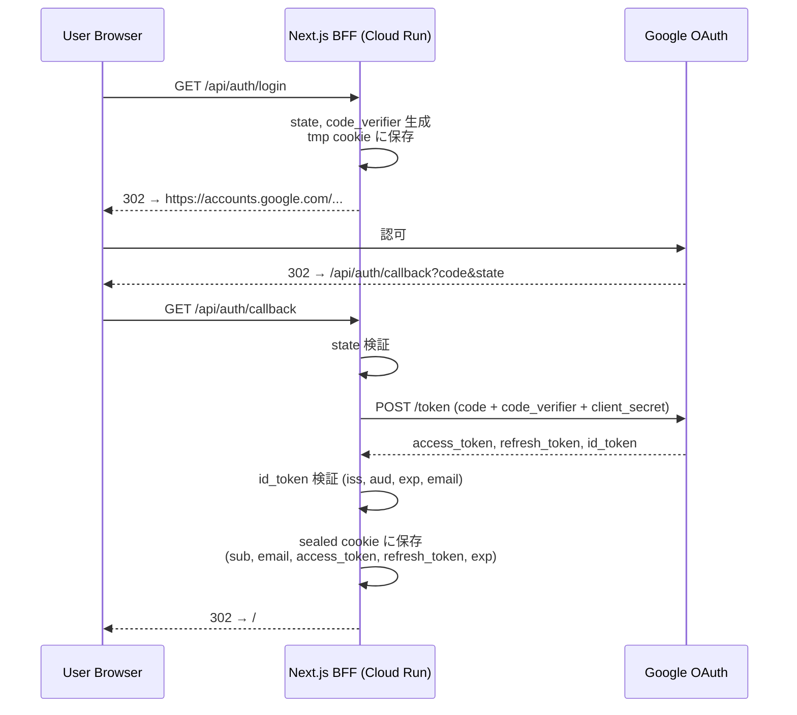
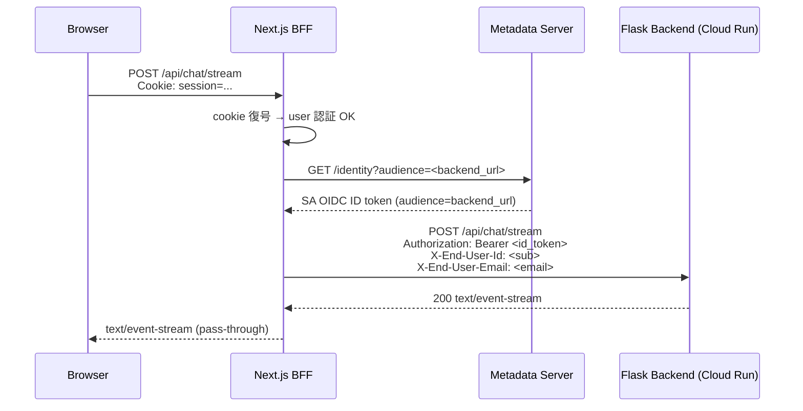

# パターン C 実装ガイド: Next.js BFF + IAM-protected Cloud Run

> 対象プロジェクト: flask-cluade-api  
> 採用パターン: 「IAP を外し Cloud Run IAM Invoker のみ」(docs/bff-oauth-iap-cloudrun.md 第3章 パターンC)  
> IdP: Google (Google Identity Services)  
> 経路: 公開 URL 経由で SA トークン認証

---

## 1. アーキテクチャ

```
[Browser SPA]
   │ HttpOnly Cookie (sealed session)
   ▼
[Next.js BFF on Cloud Run]   ← public, allow unauthenticated (Cookie でユーザー認証)
   │  ① OAuth (Google) で user 認証 / Cookie 発行
   │  ② Metadata Server から SA OIDC ID トークン取得
   │     audience = <BACKEND_CLOUD_RUN_URL>
   │  ③ Authorization: Bearer <ID_TOKEN> で転送
   ▼
[Flask Backend on Cloud Run]  ← ingress=all, allow_unauthenticated=false
                                  roles/run.invoker は BFF SA のみ
```

### サービス境界

| 役割 | サービス | 認証 | 公開状態 |
|---|---|---|---|
| SPA | Next.js (静的+クライアント) | なし | 公開 |
| BFF | Next.js Route Handlers | HttpOnly Cookie | 公開 (`--allow-unauthenticated`) |
| バックエンド | Flask (`flask-cloud-api-v2`) | SA ID トークン | 非公開 (IAM only) |

### 信頼境界

- ブラウザ JS は **Cookie の中身を見られない**（HttpOnly + Secure + SameSite=Lax）
- Google OAuth の access_token / refresh_token は **BFF の Cookie (sealed) にのみ存在**
- バックエンドへの SA ID トークンは **BFF プロセスメモリにのみ存在**（リクエスト都度発行、キャッシュは Metadata Server 側）

---

## 2. シーケンス

### 2-1. ログイン



### 2-2. API 呼び出し（SSE）



ポイント:
- バックエンド (`Flask`) は IAM で `roles/run.invoker` が BFF SA のみ → 直接 URL を叩いても 403
- エンドユーザー identity は **BFF が信頼する独自ヘッダ** (`X-End-User-*`) で渡す。Cloud Run のフロントでは付与不可能なため、バックエンドは「IAM 認証を通った = BFF SA からのみ」を前提に独自ヘッダを信頼する

### 2-3. ログアウト

```mermaid
sequenceDiagram
    participant U as Browser
    participant B as Next.js BFF
    participant G as Google
    U->>B: POST /api/auth/logout
    B->>G: POST https://oauth2.googleapis.com/revoke?token=<refresh_token>
    B-->>U: Set-Cookie: session=; Max-Age=0
```

---

## 3. GCP 側セットアップ

### 3-1. 変数

```fish
set -x PROJECT_ID infra-dev-392306
set -x REGION asia-northeast1
set -x BFF_SVC nextjs-bff
set -x BACKEND_SVC flask-cloud-api-v2
set -x BFF_SA bff-runner@$PROJECT_ID.iam.gserviceaccount.com
set -x BACKEND_SA backend-runner@$PROJECT_ID.iam.gserviceaccount.com
```

### 3-2. サービスアカウント

```bash
# BFF 用 SA
gcloud iam service-accounts create bff-runner \
  --project="$PROJECT_ID" \
  --display-name="Next.js BFF Cloud Run runner"

# バックエンド用 SA（Vertex AI / Anthropic 等を呼ぶ権限はこちらに付与）
gcloud iam service-accounts create backend-runner \
  --project="$PROJECT_ID" \
  --display-name="Flask backend Cloud Run runner"
```

### 3-3. Google OAuth クライアント作成

GCP コンソール: APIs & Services → Credentials → Create OAuth 2.0 Client ID

- Application type: **Web application**
- Authorized redirect URIs:
  - `http://localhost:3000/api/auth/callback` (開発用)
  - `https://<bff-cloudrun-url>/api/auth/callback` (本番)
- 取得した `client_id` / `client_secret` を Secret Manager へ

```bash
gcloud secrets create google-oauth-client-id --replication-policy=automatic
echo -n "<CLIENT_ID>" | gcloud secrets versions add google-oauth-client-id --data-file=-

gcloud secrets create google-oauth-client-secret --replication-policy=automatic
echo -n "<CLIENT_SECRET>" | gcloud secrets versions add google-oauth-client-secret --data-file=-

# Cookie シール用の 32 byte 秘密鍵
openssl rand -base64 32 | gcloud secrets create bff-session-secret \
  --replication-policy=automatic --data-file=-

# BFF SA に Secret 読み取り権限
for secret in google-oauth-client-id google-oauth-client-secret bff-session-secret
  gcloud secrets add-iam-policy-binding $secret \
    --member="serviceAccount:$BFF_SA" \
    --role="roles/secretmanager.secretAccessor"
end
```

### 3-4. バックエンド Cloud Run デプロイ（非公開）

```bash
gcloud run deploy "$BACKEND_SVC" \
  --project="$PROJECT_ID" \
  --region="$REGION" \
  --source=./flask-cloud-api-v2 \
  --service-account="$BACKEND_SA" \
  --no-allow-unauthenticated \
  --ingress=all
```

`--no-allow-unauthenticated` が **パターンC の要**。これで IAM 認証必須になる。

### 3-5. BFF → バックエンド 呼び出し権限

```bash
gcloud run services add-iam-policy-binding "$BACKEND_SVC" \
  --project="$PROJECT_ID" \
  --region="$REGION" \
  --member="serviceAccount:$BFF_SA" \
  --role="roles/run.invoker"
```

### 3-6. BFF デプロイ（公開）

```bash
set -x BACKEND_URL (gcloud run services describe "$BACKEND_SVC" \
  --project="$PROJECT_ID" --region="$REGION" --format='value(status.url)')

gcloud run deploy "$BFF_SVC" \
  --project="$PROJECT_ID" \
  --region="$REGION" \
  --source=./frontend \
  --service-account="$BFF_SA" \
  --allow-unauthenticated \
  --set-env-vars="BACKEND_URL=$BACKEND_URL,NODE_ENV=production" \
  --update-secrets="GOOGLE_CLIENT_ID=google-oauth-client-id:latest,GOOGLE_CLIENT_SECRET=google-oauth-client-secret:latest,SESSION_SECRET=bff-session-secret:latest"
```

デプロイ後、BFF の URL を Google OAuth クライアントの `Authorized redirect URIs` に追加して上書き。

---

## 4. Next.js BFF のディレクトリ構造

```
frontend/
├── app/
│   ├── api/
│   │   ├── auth/
│   │   │   ├── login/route.ts       # OAuth 開始
│   │   │   ├── callback/route.ts    # コード交換 → Cookie 発行
│   │   │   ├── logout/route.ts      # トークン revoke + Cookie 削除
│   │   │   └── me/route.ts          # ログイン状態確認 (フロント用)
│   │   └── chat/
│   │       ├── stream/route.ts      # SSE プロキシ
│   │       └── reset/route.ts       # POST プロキシ
│   ├── layout.tsx
│   └── page.tsx
├── lib/
│   └── auth/
│       ├── session.ts                # iron-session 設定
│       ├── google-oauth.ts           # OAuth2Client
│       └── sa-token.ts               # Cloud Run 向け ID トークン取得
├── Dockerfile
└── next.config.ts                    # output:'export' を撤去
```

---

## 5. セッション戦略（最小スケルトン）

### 5-1. 採用方式: sealed cookie 直格納

| 候補 | 採用 | 理由 |
|---|---|---|
| sealed cookie に access/refresh token を直接格納 | ✅ | 外部依存ゼロ、最小実装。トークンサイズ程度なら Cookie 4KB 制限内 |
| session id を cookie、本体は Firestore/Redis | △ | スケーラブルだが追加リソースが必要 |
| Cookie に user id のみ、毎リクエスト Google API | x | 遅い |

**ライブラリ**: [`iron-session`](https://github.com/vvo/iron-session)  
- AES-256-GCM で seal、サーバー側に状態を持たない
- リフレッシュ時は cookie を再発行

### 5-2. リフレッシュ戦略

- access_token の `expires_at` を session に保存
- API プロキシ前に残り時間チェック → 60秒以下なら refresh_token で再発行
- refresh エラー時はセッション破棄 → 401 を SPA に返却

### 5-3. CSRF 対策

- SameSite=Lax で多くのケースをカバー（GET の cross-site はトップレベルのみ）
- 状態変更 API (POST /api/chat/*) は **Origin ヘッダ検証** を BFF 側で実施
- OAuth callback は state + PKCE で固定

---

## 6. バックエンド側の受け入れ

`Flask` 側で IAM 認証を通過したリクエストには、Cloud Run が自動的に `X-Goog-IAP-JWT-Assertion` ではなく `X-Serverless-Authorization` / `Authorization` を伝搬する。**Cloud Run の IAM 経由では `X-Goog-Authenticated-User-*` ヘッダは付与されない**ため、ユーザー identity は BFF が独自ヘッダで渡す。

### 6-1. バックエンドの責務

```python
# flask-cloud-api-v2 で追加すべき検証
def get_end_user(request):
    # IAM 認証を通過 = BFF SA からのリクエストである、と前提
    # → BFF が付けた独自ヘッダを信頼してよい
    user_id = request.headers.get("X-End-User-Id")
    email = request.headers.get("X-End-User-Email")
    if not user_id:
        abort(401)
    return {"id": user_id, "email": email}
```

### 6-2. 直接アクセス防御

- `--no-allow-unauthenticated` で IAM 必須化済み
- BFF SA 以外には `run.invoker` を付けない
- 開発者のアクセスは `gcloud run services proxy` 経由で（ローカルに `127.0.0.1:8080` をフォワード）

---

## 7. ローカル動作確認

### 7-1. 前提

- Python 3.12+ / `uv`
- Node.js 22+ / `npm`
- Google Cloud プロジェクト 1つ（OAuth クライアント発行用、課金不要）

### 7-2. Google OAuth クライアントを「ローカル用」に発行

GCP コンソール → APIs & Services → Credentials → **Create OAuth client ID**

- Application type: **Web application**
- Name: `nextjs-bff-local`（任意）
- **Authorized redirect URIs** に `http://localhost:3000/api/auth/callback` を追加
- 取得した `Client ID` / `Client secret` をメモ

> 本番用 redirect URI は後でデプロイ時に同じクライアントへ追加する。ローカル専用にクライアントを分けても良い。

### 7-3. Flask バックエンドを起動

```fish
cd flask-cloud-api-v2
uv sync
uv run flask --app src/app run --port 8000 --debug
```

別シェルで疎通確認:
```fish
curl -s http://localhost:8000/ ; echo
# {"message": "Hello world."}
```

ローカルでは Flask に IAM 認証はかからない。`Authorization` ヘッダ / `X-End-User-*` ヘッダが来ても来なくても動く現状の app.py のままで OK。

### 7-4. Next.js BFF の起動準備

```fish
cd frontend
npm install
cp .env.example .env.local
```

`frontend/.env.local` を以下のように埋める:

```bash
BACKEND_URL=http://localhost:8000
DISABLE_SA_TOKEN=1
GOOGLE_CLIENT_ID=<7-2 で取得した Client ID>
GOOGLE_CLIENT_SECRET=<7-2 で取得した Client secret>
GOOGLE_REDIRECT_URI=http://localhost:3000/api/auth/callback
SESSION_SECRET=<openssl rand -base64 32 の出力>
ALLOWED_ORIGINS=http://localhost:3000
```

`SESSION_SECRET` 生成:
```fish
openssl rand -base64 32
```

### 7-5. Next.js BFF を起動

```fish
cd frontend
npm run dev
```

→ `http://localhost:3000` で起動。

### 7-6. ブラウザでの確認手順

1. **未ログイン状態の確認**
   ```fish
   curl -i http://localhost:3000/api/auth/me
   # HTTP/1.1 401 ... {"authenticated":false}
   ```

2. **ログイン**
   - ブラウザで `http://localhost:3000/api/auth/login` を直接開く
   - Google の同意画面 → 承諾
   - `/api/auth/callback` 経由で `/` にリダイレクトされる
   - DevTools → Application → Cookies → `bff_session` が **HttpOnly / Secure(=false in dev) / SameSite=Lax** で存在することを確認

3. **ログイン状態確認**
   ```fish
   # ブラウザのコンソールで
   await fetch('/api/auth/me').then(r => r.json())
   # → { authenticated: true, sub: "...", email: "..." }
   ```

4. **チャット API が BFF 経由で Flask に届くこと**
   - ブラウザで `http://localhost:3000/` のチャット UI からメッセージ送信
   - Flask のコンソールに `POST /api/chat/stream` が出ること
   - Flask 側で受信ヘッダを確認したい場合は一時的に `app.py` に
     ```python
     print(dict(request.headers))
     ```
     を入れ、`X-End-User-Id` / `X-End-User-Email` が来ているか確認

5. **CSRF ガードの確認**
   ```fish
   # 別 Origin からの POST は 403 になること
   curl -i -X POST http://localhost:3000/api/chat/reset \
     -H "Origin: https://evil.example" \
     -H "Content-Type: application/json" \
     -b "bff_session=<コピペ>" \
     -d '{}'
   # → HTTP/1.1 403 ... {"error":"csrf_forbidden"}
   ```

6. **ログアウト**
   ```fish
   curl -i -X POST http://localhost:3000/api/auth/logout \
     -H "Origin: http://localhost:3000" \
     -b "bff_session=<コピペ>"
   # → Set-Cookie: bff_session=; Max-Age=0
   ```

### 7-7. つまずきポイント

| 症状 | 原因と対処 |
|---|---|
| `redirect_uri_mismatch` | 7-2 の redirect URI と `.env.local` の `GOOGLE_REDIRECT_URI` の完全一致を確認（末尾スラッシュ・ポート含む） |
| `SESSION_SECRET must be set and >= 32 chars` | `.env.local` の `SESSION_SECRET` が短い。`openssl rand -base64 32` で再生成 |
| `ECONNREFUSED 127.0.0.1:8000` | Flask 未起動。7-3 のシェルが生きているか確認 |
| `/api/auth/me` が永遠に 401 | DevTools で Cookie が発行されているか、`SameSite` 設定の影響でブラウザに保存されない（http の場合は `Secure` を外しているので大丈夫なはず） |
| `csrf_forbidden` がフロントからの fetch で出る | `useChat.ts` の `credentials: 'include'` が消えていないか、`ALLOWED_ORIGINS=http://localhost:3000` が `.env.local` に入っているか確認 |
| OAuth 画面で「未確認のアプリ」警告 | OAuth 同意画面で「テストユーザー」に自分の Google アカウントを追加 |

### 7-8. 仕組み（ローカルと本番の差分）

| 観点 | ローカル | 本番 |
|---|---|---|
| SA ID トークン | 取得しない (`DISABLE_SA_TOKEN=1`) | ADC + Metadata Server から取得 |
| Flask の認証 | 認証なしの素 Flask | Cloud Run IAM (`--no-allow-unauthenticated`) |
| Cookie の `Secure` 属性 | false (HTTP 許可) | true |
| Origin | `http://localhost:3000` | BFF Cloud Run の HTTPS URL |
| Google OAuth redirect | `http://localhost:3000/api/auth/callback` | `https://<bff>/api/auth/callback` |

ローカルで動けば、`DISABLE_SA_TOKEN` を外して `BACKEND_URL` を本番 Cloud Run URL に差し替えれば、ロジックはそのまま本番に持っていける。

---

## 8. トレードオフと残課題

| 項目 | 内容 |
|---|---|
| Cookie に refresh_token を入れる是非 | sealed されているとはいえブラウザに残る。漏洩時の被害を抑えるため Cloud Run Secret Manager に格納した「グローバル seal 鍵」を定期ローテーション |
| BFF のスケーリング | Cloud Run の cold start で OAuth2Client / GoogleAuth が初期化される。SSE 接続が long-lived なため `min-instances=1` を推奨 |
| SSE タイムアウト | Cloud Run の最大リクエストタイムアウトは 60分（HTTP/1）/ 60分（HTTP/2）。長時間チャットなら `--timeout=3600` を明示 |
| 監査ログ | バックエンドの Cloud Run audit log では `principalEmail` が常に BFF SA。エンドユーザーは独自ヘッダのみなので、バックエンド側で構造化ログに `X-End-User-Id` を出力する |
| `X-End-User-*` の改ざん耐性 | BFF が信頼境界内であれば問題なし。万一に備えるなら BFF が短命 JWT (HS256) を発行してバックエンドが共有秘密で検証する強化案あり |
| 本番セッションストア | sealed cookie 方式は失効処理が即時に行えない（クライアント側で cookie を捨てるしかない）。要件次第で Firestore セッションへ移行 |

---

## 9. 参考: docs/bff-oauth-iap-cloudrun.md からの差分

| 観点 | パターン A (IAP あり) | **パターン C (本書)** |
|---|---|---|
| IAP | あり | なし |
| BFF → backend 認証 | Google ID Token (aud=IAP Client ID) | Google ID Token (aud=backend URL) |
| Cloud Run 設定 | `--allow-unauthenticated` + IAP | `--no-allow-unauthenticated` |
| 監査ログ | IAP のアクセスログが追加で取れる | Cloud Run のリクエストログのみ |
| Context-Aware Access | 利用可能 | 不可 |
| 構成の複雑さ | 中 | 低 |

---

## 10. 実装ファイル一覧（このリポジトリでの最小スケルトン）

| パス | 役割 |
|---|---|
| `frontend/next.config.ts` | `output:'export'` を撤去 |
| `frontend/package.json` | `iron-session`, `google-auth-library` を追加 |
| `frontend/lib/auth/session.ts` | iron-session 設定とセッション型 |
| `frontend/lib/auth/google-oauth.ts` | Google OAuth2Client ラッパ |
| `frontend/lib/auth/sa-token.ts` | Cloud Run 向け ID トークン発行 |
| `frontend/app/api/auth/login/route.ts` | OAuth 開始 |
| `frontend/app/api/auth/callback/route.ts` | コード交換 + Cookie 発行 |
| `frontend/app/api/auth/logout/route.ts` | revoke + Cookie 削除 |
| `frontend/app/api/auth/me/route.ts` | ログイン状態 (sub, email) を返却 |
| `frontend/app/api/chat/stream/route.ts` | SSE プロキシ |
| `frontend/app/api/chat/reset/route.ts` | POST プロキシ |
| `frontend/hooks/useChat.ts` | 同一オリジン (`/api/...`) 呼び出しに変更 |
| `frontend/Dockerfile` | Cloud Run 用 (Next.js standalone) |
| `frontend/.env.example` | 環境変数テンプレ |
